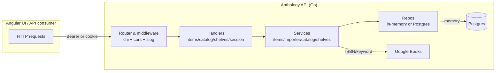
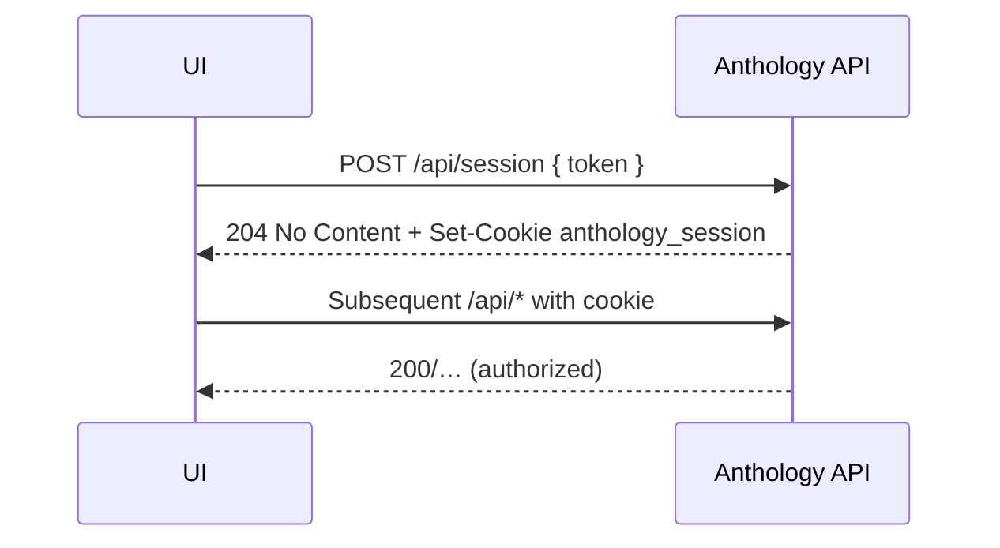
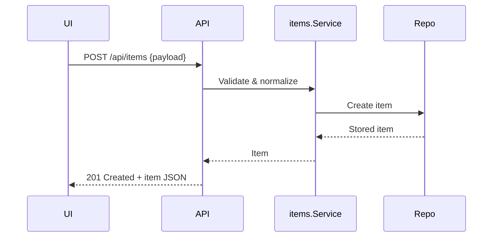
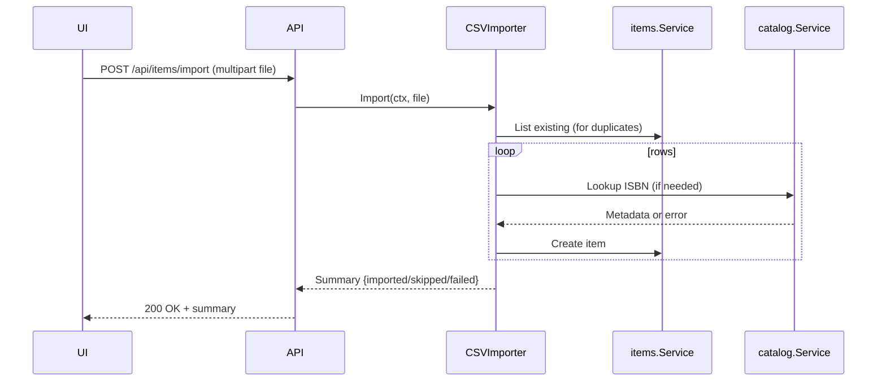
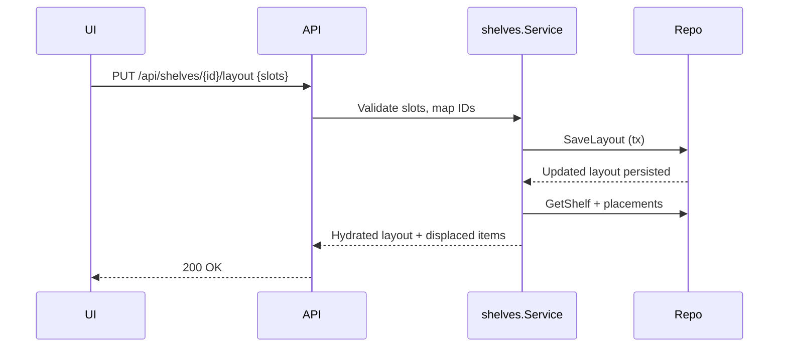

# Anthology API deep dive

This document reflects the current API implementation under `cmd/api` and `internal/` as of this commit. It is intended for engineers onboarding to the backend and focuses on endpoints, request flows, data models, validation, and infrastructure concerns.

## High-level shape

* Go 1.22, chi router, `slog` logging.
* Runtime config from env/_FILE (see **Configuration**).
* Supports `DATA_STORE=memory` (demo seed) or Postgres (sqlx, embedded migrations).
* Metadata lookups proxy Google Books; CSV import reuses that pipeline.
* Authentication: bearer token header or HttpOnly session cookie minted by `/api/session`.

### Runtime topology



## Configuration

* `DATA_STORE` (`memory` default, or `postgres`).
* `DATABASE_URL` (`postgres://…`) or `DATABASE_URL_FILE`.
* `PORT`/`HTTP_PORT` (default 8080).
* `ALLOWED_ORIGINS` CSV list; wildcards only allowed in `APP_ENV=development`.
* `LOG_LEVEL` (`debug`, `info`, `warn`, `error`).
* `API_TOKEN` (required outside dev; blank disables auth) or `API_TOKEN_FILE`.
* `GOOGLE_BOOKS_API_KEY` (required; `_FILE` supported with default `/run/secrets/anthology_google_books_api_key`).
* `APP_ENV` (`development` default) toggles cookie `Secure` flag and auth requirement for prod.

`cmd/api/main.go` loads config, builds logger, chooses repository via `buildRepositories`, applies migrations when using Postgres, then binds `http.Server` with sensible timeouts.

## Authentication and sessions

* **Bearer**: `Authorization: Bearer <API_TOKEN>`.
* **Session cookie**: `/api/session` endpoints hash the configured token with SHA-256 and set `anthology_session` (HttpOnly, SameSite=Lax, Secure outside dev, 12h TTL).
* Auth middleware accepts either Bearer header or valid session cookie; otherwise 401 with `WWW-Authenticate: Bearer`.
* When `API_TOKEN` is empty, auth is disabled and a startup warning is logged.

## Endpoints (current)

Base URL: `http://<host>:<port>`. All `/api/*` endpoints are authenticated unless `API_TOKEN` is blank.

| Method | Path | Description | Handler |
| --- | --- | --- | --- |
| GET | `/health` | Liveness; returns `{status, environment}`. | inline in router |
| POST | `/api/session` | Validate token, set session cookie. | `SessionHandler.Login` |
| GET | `/api/session` | Report active session (204) or 401. | `SessionHandler.Status` |
| DELETE | `/api/session` | Clear session cookie. | `SessionHandler.Logout` |
| GET | `/api/items` | List items with filters (type/status/letter/query/limit). | `ItemHandler.List` |
| POST | `/api/items` | Create item. | `ItemHandler.Create` |
| POST | `/api/items/import` | CSV upload (5 MiB limit) for bulk import. | `ItemHandler.ImportCSV` |
| GET | `/api/items/{id}` | Get item by UUID. | `ItemHandler.Get` |
| PUT | `/api/items/{id}` | Update mutable fields (partial). | `ItemHandler.Update` |
| DELETE | `/api/items/{id}` | Delete item. | `ItemHandler.Delete` |
| GET | `/api/catalog/lookup` | Proxy metadata lookup (currently books only). | `CatalogHandler.Lookup` |
| GET | `/api/shelves` | List shelf summaries. | `ShelfHandler.List` |
| POST | `/api/shelves` | Create shelf with default single-slot layout. | `ShelfHandler.Create` |
| GET | `/api/shelves/{id}` | Get shelf layout + placements. | `ShelfHandler.Get` |
| PUT | `/api/shelves/{id}/layout` | Replace layout; returns displaced items. | `ShelfHandler.UpdateLayout` |
| POST | `/api/shelves/{id}/slots/{slotId}/items` | Assign item to slot. | `ShelfHandler.AssignItem` |
| DELETE | `/api/shelves/{id}/slots/{slotId}/items/{itemId}` | Remove item from slot (unplaced). | `ShelfHandler.RemoveItem` |

### Error contract

* JSON responses with `{"error": "<message>"}` for errors.
* Unknown fields rejected on create/update (strict JSON decode); payload limited to 1 MiB.
* CSV upload returns 400 on invalid/missing file, 413 on size overflow, 500 on importer errors.
* Catalog lookup maps validation to 400, unsupported category to 400, not-found to 404, upstream failure to 502.

## Data model (API surface)

Items (`internal/items.Item`):

```json
{
  "id": "uuid",
  "title": "string",
  "creator": "string",
  "itemType": "book|game|movie|music",
  "releaseYear": 2024,
  "pageCount": 300,
  "currentPage": 120,
  "isbn13": "978...",
  "isbn10": "1234567890",
  "description": "string",
  "coverImage": "https://… or data:<mime>;base64,…",
  "readingStatus": "read|reading|want_to_read|\"\"",
  "readAt": "RFC3339 datetime",
  "notes": "string",
  "createdAt": "RFC3339 datetime",
  "updatedAt": "RFC3339 datetime",
  "shelfPlacement": {
    "shelfId": "uuid",
    "shelfName": "string",
    "slotId": "uuid",
    "rowIndex": 0,
    "colIndex": 1
  }
}
```

Shelf layout (`ShelfWithLayout`):

```json
{
  "shelf": { "id": "uuid", "name": "string", "description": "string", "photoUrl": "string", "createdAt": "...", "updatedAt": "..." },
  "rows": [{ "id": "uuid", "shelfId": "uuid", "rowIndex": 0, "yStartNorm": 0.0, "yEndNorm": 0.5, "columns": [{ "id": "uuid", "shelfRowId": "uuid", "colIndex": 0, "xStartNorm": 0.0, "xEndNorm": 0.5 }] }],
  "slots": [{ "id": "uuid", "shelfId": "uuid", "shelfRowId": "uuid", "shelfColumnId": "uuid", "rowIndex": 0, "colIndex": 0, "xStartNorm": 0.0, "xEndNorm": 0.5, "yStartNorm": 0.0, "yEndNorm": 0.5 }],
  "placements": [{ "item": { /* Item */ }, "placement": { "id": "uuid", "itemId": "uuid", "shelfId": "uuid", "shelfSlotId": "uuid", "createdAt": "..." } }],
  "unplaced": [{ "item": { /* Item */ }, "placement": { "id": "uuid", "itemId": "uuid", "shelfId": "uuid", "shelfSlotId": null, "createdAt": "..." } }]
}
```

CSV import summary (`internal/importer.Summary`):

```json
{ "totalRows": 5, "imported": 3, "skippedDuplicates": [{ "row": 3, "title": "Dune", "identifier": "9780441172719", "reason": "duplicate isbn13" }], "failed": [{ "row": 4, "title": "", "identifier": "999", "error": "ISBN/UPC 999 is not valid" }] }
```

## Validation rules (service layer)

Items:
* Required: `title`, `itemType`.
* Year/page counts must be positive if provided; `currentPage` >= 0 and cannot exceed `pageCount`.
* Cover image: empty allowed; data URI must be valid base64 and <= 500 KB; URL length <= 4096 chars.
* Reading status only valid for books. Rules:
  * `read` requires `readAt`.
  * `reading` requires `currentPage` and (if present) must not exceed `pageCount`.
  * `want_to_read` clears read/progress.

CSV importer:
* Requires header columns: `title,creator,itemType,releaseYear,pageCount,isbn13,isbn10,description,coverImage,notes` (case-insensitive).
* Empty rows skipped; per-row errors reported in `failed`.
* Duplicate detection across title/ISBN13/ISBN10 using existing catalog + rows processed in-session.
* Book rows with missing title but ISBN/UPC will call catalog lookup to backfill metadata; otherwise title is required.
* Upload capped at 5 MiB (HTTP handler).

Catalog lookup:
* Query trimmed, must be >=3 characters.
* Only `category=book` supported; others return `ErrUnsupportedCategory`.
* ISBN normalization strips non-digits and validates length 10/13 (supports trailing X).
* Publish year parsed from Google Books `publishedDate` via regex; cover URLs forced to https.

Shelves:
* Layout updates require at least one slot; row/col indexes must be non-negative; slot boundaries must be within [0,1] and non-overlapping per key.
* Slot IDs preserved when coordinates refer to existing rows/cols to keep placements stable; removed slots trigger displaced items returned to client and unplaced in persistence.

## Persistence

* In-memory repos for items and shelves used when `DATA_STORE=memory`; seeded demo data and shelf layout created in `cmd/api/main.go`.
* Postgres repos (`internal/items/postgres_repository.go`, `internal/shelves/postgres_repository.go`) use `sqlx`:
  * Items: CRUD with lateral join to latest placement (`item_shelf_locations` ordered by created_at).
  * Shelves: transactional upserts for rows/cols/slots; placements stored in `item_shelf_locations`; layout updates delete missing slots/columns/rows and null out placements for removed slots.
* Connection pool defaults: max open 10, max idle 5, conn max lifetime 30m, idle time 5m.

### Schema (migrations)

* `0001_create_items.sql`: base items table.
* `0002_add_book_fields.sql`: book-specific fields (read_at, reading_status).
* `0003_add_cover_image.sql`: coverImage column.
* `0004_add_book_status.sql`: refined statuses.
* `0005_add_reading_progress.sql`: current_page.
* `0006_create_shelves.sql`: shelves, rows, columns, slots, item_shelf_locations.

`internal/platform/migrate` embeds migrations and applies pending files on startup (exclusive lock on `schema_migrations`).

## Request flows

### Login flow



### Item creation



### CSV import + metadata enrichment



### Shelf layout update



## Operational notes

* CORS defaults: `http://localhost:4200,http://localhost:8080`; override via `ALLOWED_ORIGINS`.
* Timeouts: Request timeout middleware 60s; HTTP server read/write 15s, idle 60s.
* Logging: `slog` text handler; HTTP middleware logs method/path/status/duration.
* CSV upload size guard at handler level; JSON max 1 MiB.
* Memory mode seeds curated demo items and a sample shelf layout for local demos.

## How to run locally

```bash
export DATA_STORE=memory
export PORT=8080
export API_TOKEN="local-dev-token"
export GOOGLE_BOOKS_API_KEY="your-key"
go run ./cmd/api
```

Health: `curl http://localhost:8080/health`  
List items (with auth if token set): `curl -H "Authorization: Bearer $API_TOKEN" http://localhost:8080/api/items`
