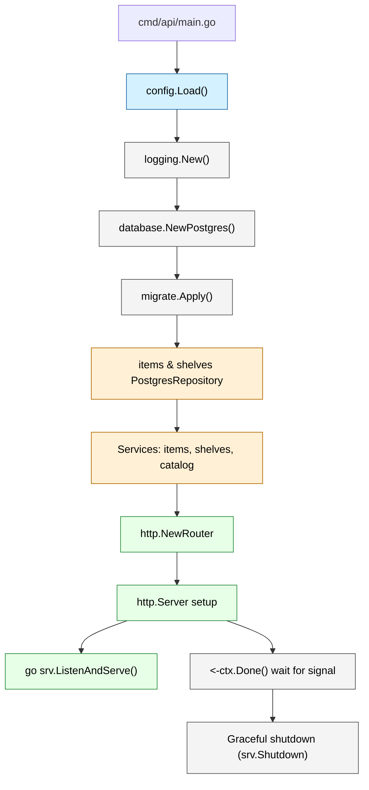

# Go Startup Flow (Mermaid)

## Diagram Notes

- `config.Load()` gathers environment-driven settings (ports, OAuth config, CORS).
- `logging.New()` builds the global `slog.Logger` instance used across packages.
- The API initializes Postgres, runs Goose migrations, and wires `items`/`shelves` repositories.
- Domain services (`items`, `shelves`, `catalog`) encapsulate validation and business logic; they are injected into HTTP handlers.
- `http.NewRouter` composes middleware, auth, session handlers, and API endpoints. Static assets moved to the standalone UI container, so non-API paths return standard 404 responses.
- The HTTP server runs `ListenAndServe` in a goroutine; the main goroutine blocks on the signal-aware context and then calls `srv.Shutdown` with a timeout to drain connections gracefully.
