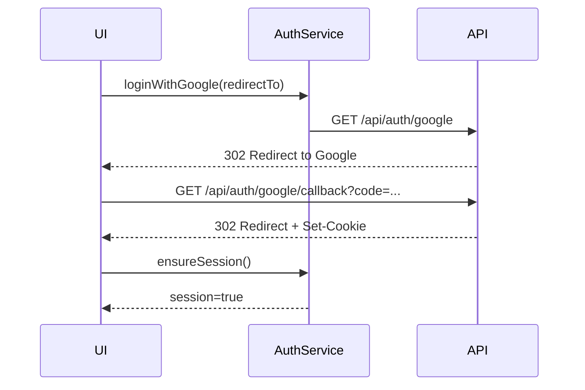
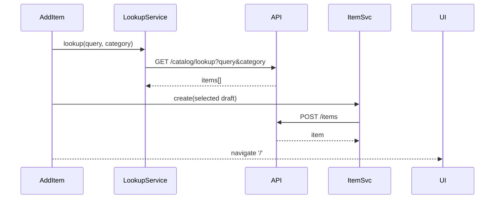
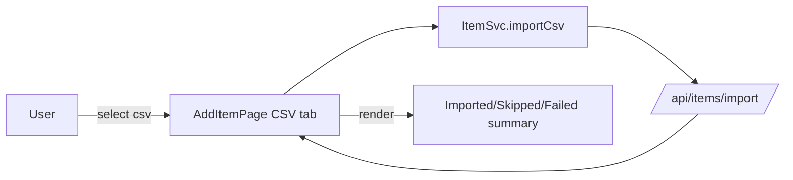

# Anthology UI deep dive

Snapshot of the Angular 20 Material frontend as of this commit. Covers runtime config, routing, auth, data flows, and component/service responsibilities.

## Stack + conventions

* Angular 20, standalone components, Signals (`signal`, `computed`) for local state.
* Angular Material 3 theme (`web/src/styles.scss`), 2-space SCSS per component.
* HTTP via `HttpClient`; services live in `web/src/app/services`.
* Routing in `app.routes.ts`; guard enforces session.
* API base URL resolved at runtime (meta tag, global override, or fallback).

### Runtime config resolution

```mermaid
flowchart LR
    meta[<meta name=\"anthology-api\">] --> env
    global[globalThis.NG_APP_API_URL] --> env
    origin[window.location.origin + '/api'] --> env
    env[environment.apiUrl] --> services
```

Priority: `globalThis.NG_APP_API_URL` (from `assets/runtime-config.js` replacement) → meta tag content → origin `/api` (if https page) → `http://localhost:8080/api`. HTTPS pages ignore http meta URLs for safety.

## Routing + shell

* `app.routes.ts`:
  * Guarded shell (`AppShellComponent`) at `/` with children:
    * `/` → `ItemsPageComponent`
    * `/items/add` → `AddItemPageComponent`
    * `/items/:id/edit` → `EditItemPageComponent`
    * `/shelves` → `ShelvesPageComponent`
    * `/shelves/add` → `AddShelfPageComponent`
    * `/shelves/:id` → `ShelfDetailPageComponent`
  * `/login` → `LoginPageComponent`
  * Fallback redirects to `/`.
* `AppShellComponent`: header + sidebar nav, logout action, toggles drawer. Uses `AuthService.logout()` then redirects to `/login`.

## Auth flow

* `AuthService`:
  * `loginWithGoogle(redirectTo?)` → redirects to `/api/auth/google`.
  * `ensureSession()` → caches state; otherwise `GET /api/session` to validate cookie.
  * `logout()` → `DELETE /api/session` (best-effort, treats 401 as logged out).
* `authGuard`:
  * Calls `ensureSession`; if false, redirects to `/login?redirectTo=<previous>`.
* Login page:
  * Google sign-in button; renders OAuth errors from callback query params and offers a "Clear session" action.



## Services (API clients)

* `ItemService`: list/filter items, get/create/update/delete, CSV import. Normalizes form fields (numbers/dates) before sending.
* `ItemLookupService`: `GET /catalog/lookup` for metadata search.
* `AuthService`: session/login/logout (above).
* Shelves services live under `services` (detail not shown here) for layout CRUD and placements.

## Feature surfaces

### Library (`ItemsPageComponent`)

* Filters:
  * Item type (`type` query)
  * Alphabet letter (`letter`)
  * Book status (`status` for reading states)
  * Limit optional
* View modes: table (default) or grid with cover thumbnails.
* Actions: edit item, add item, navigate to shelf placement (if present).
* Data load: reactive to filter signals via `toObservable(computed(...))`; shows snack bar on load failure.

### Add Item (`AddItemPageComponent`)

Tabs:
1) **Search** (default):
   * Lookup by category (books enabled; others disabled) + query; validates length ≥3.
   * Barcode scanning: tries native `BarcodeDetector`; falls back to `@zxing/browser`; populates query then triggers lookup.
   * Lookup uses `ItemLookupService`, maps metadata into `ItemForm` drafts. Quick add saves immediately; “Use for manual” populates manual form and switches tab.
2) **Manual Entry**:
   * `ItemFormComponent` handles validation UI. Save delegates to `ItemService.create`; cancel returns to library.
   * Displays badge noting which query populated the draft (if coming from search).
3) **CSV Import**:
   * Shows required columns; links `csv-import-template.csv`.
   * Upload via `ItemService.importCsv`; shows progress status; summarizes imported/skipped/failed rows; allows reset.
   * Handler auto-selects tab when importing or on error.

### Edit Item (`EditItemPageComponent`)

* Loads item by id, binds to `ItemFormComponent`.
* Save uses `ItemService.update`; delete removes then navigates home; handles errors with snack bars.

### Shelves

* `ShelvesPageComponent`: lists shelf summaries with counts.
* `AddShelfPageComponent`: create with name/description/photoUrl; uses Shelves service to POST.
* `ShelfDetailPageComponent`: renders the photo-backed shelf layout.
  * **Visual Layout Editor**: In "Edit Layout" mode, users can draw slots on the shelf photo.
    * **Drag-and-drop**: Pointer events track start/end coordinates to define slot boundaries (normalized 0-1).
    * **Axis locking**: Dragging significantly along one axis locks movement to X or Y to ensure clean alignment.
    * **Form integration**: `LayoutRowGroup`/`LayoutColumnGroup` form arrays mirror the visual state, allowing fine-grained numeric adjustments.
  * **Placement**: In "View" mode, selecting a slot shows assigned items. Users can search the catalogue to assign new items or remove existing ones.
  * **Drill-in**: Supports `?slot=<uuid>` to highlight a specific location when navigating from an item.

### Shared components

* `AppHeaderComponent` / `SidebarComponent`: navigation chrome with action buttons (add item/shelf, logout).
* `ItemFormComponent`: reusable form for create/edit; emits `save` and `cancel`; handles reading-status-dependent inputs and cover image fields.

## Data models (UI)

* `Item` / `ItemForm` mirror API fields (`itemType`, `releaseYear`, `pageCount`, `isbn13/10`, `coverImage`, `readingStatus`, `readAt`, `notes`, `shelfPlacement` summary).
* `CsvImportSummary`: `{ totalRows, imported, skippedDuplicates[], failed[] }` used by Add Item CSV tab.

## UI ↔ API flows

### Item lookup to quick add



### CSV import status



### Shelf placement drill-in

* Items page “View shelf” action navigates to `/shelves/:id?slot=<slotId>`; shelf detail highlights requested slot (handled in component via query param).

## Runtime behaviors & UX guardrails

* HTTP errors surface snack bars with friendly messages; unauthenticated errors mark session false and route to login.
* CSV import shows 5 MiB limit errors; lookup errors prefer server-provided message.
* Barcode scanning gracefully degrades to manual entry; stops stream/animation on navigation or manual stop.
* Signals minimize change detection churn; `takeUntilDestroyed` cleans subscriptions.

## How to run the UI locally

```bash
cd web
npm install
npm start   # dev server on http://localhost:4200
```

Ensure the API is running (default at `http://localhost:8080/api`). Configure the Google OAuth env vars so the login flow works. In `APP_ENV=development`, cookies are non-secure for localhost. To point at a different backend, set `NG_APP_API_URL` in `web/src/assets/runtime-config.js` at build/start time or update the meta tag in `web/src/index.html`.
